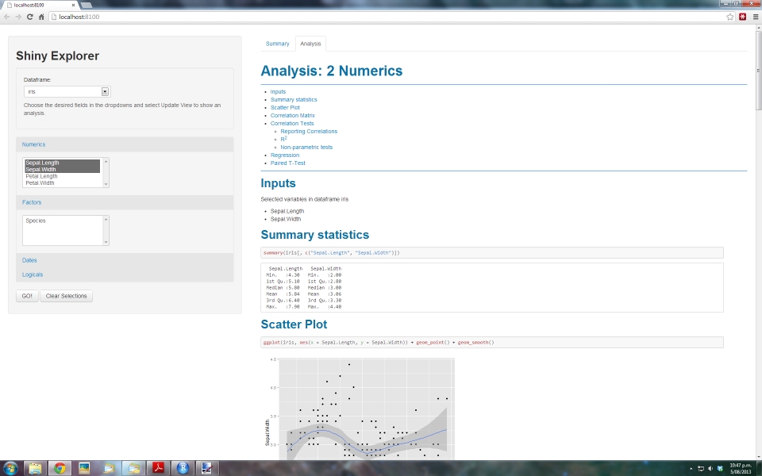

shiny-explorer
==============

Shiny (www.rstudio.com/shiny) based data explorer with report templates based on field selection.



## Instructions

```
shiny:::runApp("../shiny-explorer")
```

## Template Processing

All templates undergo (in order):
* gsub for mydf, numeric, factor1 etc
* brew
* knit2html
